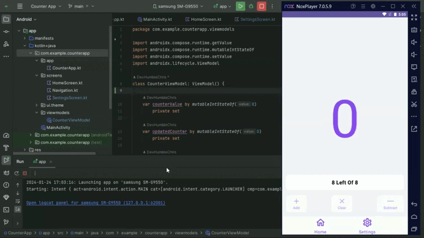

Jetpack Compose Counter App Challenge
=====================================

Overview
--------

This repository contains my submission for the Jetpack Compose Counter App Challenge. The challenge was to create a simple counter application using Jetpack Compose, allowing users to increment and decrement a counter value.

Features
--------

- Increment and decrement buttons to adjust the counter value.
- Display of the current counter value.
- Responsive and user-friendly UI.
- Efficient state management using Jetpack Compose.

Preview
-----------


Technologies Used
-----------------

- [Kotlin](https://kotlinlang.org/)
- Jetpack Compose

How to Run
----------

1. Clone the repository:

```bash
    git clone https://github.com/DevHumbleChris/counterapp.git
```

2. Open the project in Android Studio.
3. Run the app on an emulator or a physical device.

Code Structure
--------------

The codebase is organized as follows:

- `app/src/main/java/com/example/counterapp/` - Contains the main source code.
- `app/src/main/res/` - Contains resources such as layout files and drawables.

Dependencies
------------

- Android Gradle Plugin
- Jetpack Compose
- Navigation

Contributing
------------

Feel free to submit issues and pull requests. Contributions are welcome!

License
-------

This project is licensed under the MIT License.

Acknowledgments
---------------

I would like to express my gratitude to [@Hutsy](https://twitter.com/Hutsydev) for making UI development in Android more enjoyable.
